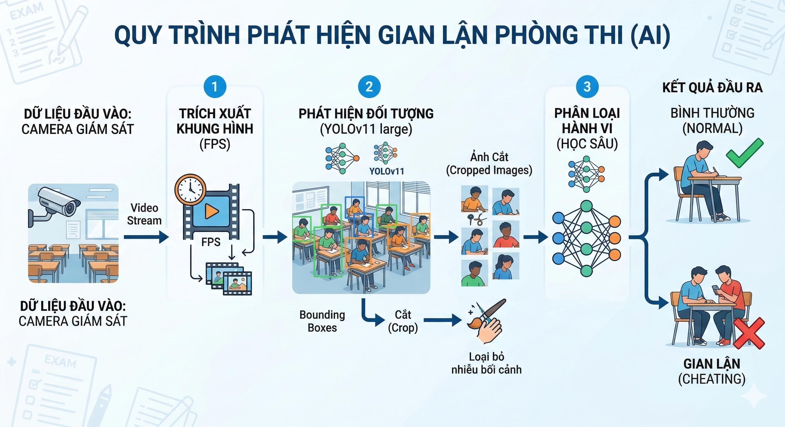
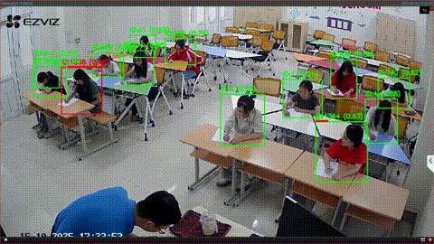
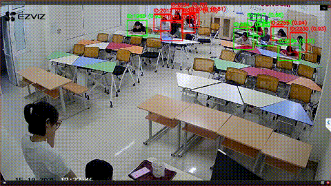

# Hệ thống nhận dạng sinh viên gian lận trong thi cử dựa trên trí tuệ nhân tạo
### Ứng dụng tại Trường Ngoại ngữ - Đại học Thái Nguyên

<p align="center">
  
</p>

<p align="center">
Hệ thống ứng dụng <b>Trí tuệ nhân tạo (AI)</b> và <b>Thị giác máy tính (Computer Vision)</b> để phát hiện các hành vi gian lận của sinh viên trong quá trình thi cử.
</p>

---

# 📌 Giới thiệu

Trong bối cảnh giáo dục hiện đại, việc đảm bảo **tính trung thực và công bằng trong thi cử** là một vấn đề quan trọng. Tuy nhiên, với số lượng sinh viên lớn, việc giám sát thủ công trong phòng thi gặp nhiều khó khăn và hạn chế.

Dự án này xây dựng một **hệ thống tự động phát hiện hành vi gian lận trong thi cử** dựa trên **AI và Deep Learning**. Hệ thống phân tích hình ảnh hoặc video thu từ camera giám sát trong phòng thi để phát hiện các hành vi bất thường như:

- Nhìn sang bài của sinh viên khác
- Sử dụng điện thoại trong khi thi
- Trao đổi giữa các sinh viên
- Các hành vi đáng ngờ khác

Hệ thống được xây dựng nhằm hỗ trợ **giảng viên và cán bộ coi thi** nâng cao hiệu quả giám sát và đảm bảo **tính minh bạch trong quá trình thi cử**.

---

# 🧠 Pipeline của hệ thống

Pipeline tổng thể của hệ thống được mô tả trong hình dưới đây.

<p align="center">
  
</p>

Các bước xử lý chính của hệ thống gồm:

1. **Thu nhận dữ liệu**
   - Thu thập video hoặc hình ảnh từ camera giám sát phòng thi.

2. **Tiền xử lý dữ liệu**
   - Trích xuất khung hình từ video
   - Chuẩn hóa và resize ảnh

3. **Phát hiện đối tượng**
   - Sử dụng mô hình Deep Learning để phát hiện:
   - Sinh viên
   - Điện thoại
   - Các vật thể liên quan

4. **Phân tích hành vi**
   - Phân tích tư thế, hướng nhìn và tương tác giữa các sinh viên

5. **Phân loại trạng thái**
   - Bình thường
   - Gian lận

6. **Xuất kết quả**
   - Hiển thị cảnh báo hoặc kết quả phân tích

---

# 💻 Yêu cầu phần cứng

Hệ thống có thể chạy trên các máy tính có cấu hình sau:

| Thành phần | Yêu cầu tối thiểu | Khuyến nghị |
|-------------|------------------|-------------|
| CPU | Intel Core i3 | Intel Core i7 |
| RAM | 8 GB | 16 GB |
| GPU | NVIDIA GTX 1050Ti | NVIDIA RTX 3060 |

GPU giúp tăng tốc đáng kể quá trình **huấn luyện và suy luận mô hình**.

---

# 🧪 Yêu cầu phần mềm

## Ngôn ngữ lập trình

- Python 3.8 trở lên

## Thư viện sử dụng

```bash
numpy
pytorch
ultralytics
transformers
opencv-python
scikit-learn
matplotlib
pandas
tqdm
```

---

# 📊 Kết quả của mô hình

Các kết quả đánh giá hiệu suất của mô hình được lưu trong thư mục: metrics/

Thư mục này bao gồm:

- Các chỉ số đánh giá mô hình (Accuracy, Precision, Recall, F1-score)
- Confusion Matrix
- Biểu đồ đánh giá quá trình huấn luyện
- Kết quả thử nghiệm trên tập dữ liệu kiểm tra

Người dùng có thể xem chi tiết các kết quả này để đánh giá hiệu quả của mô hình trong việc phát hiện hành vi gian lận của sinh viên.

---

# 📂 Mã nguồn chương trình

Toàn bộ mã nguồn của hệ thống được đặt trong thư mục: SourceCode_v6/


Thư mục này bao gồm:

- Code huấn luyện mô hình (training)
- Code chạy suy luận (inference)
- Các module tiền xử lý dữ liệu
- Các script phục vụ thử nghiệm và đánh giá

Người dùng có thể tham khảo hoặc chỉnh sửa mã nguồn để phát triển thêm các chức năng cho hệ thống.

---

# 🎥 Video demo kết quả

<p align="center">
  
</p>

<p align="center">
  
</p>

***Video minh họa hoạt động của hệ thống có thể xem [tại đây](https://drive.google.com/drive/folders/1I4nwahS337eaDhY-zkS3Zr5ZvX4tvLn9?usp=drive_link)***


Video demo bao gồm:

- Phát hiện sinh viên trong phòng thi
- Nhận dạng các hành vi đáng ngờ
- Hiển thị kết quả phát hiện trên video

---

# 👨‍💻 Tác giả

Dự án được thực hiện trong khuôn khổ nghiên cứu:

**“Xây dựng hệ thống nhận dạng sinh viên gian lận trong thi cử dựa trên trí tuệ nhân tạo và ứng dụng tại Trường Ngoại ngữ - Đại học Thái Nguyên”**

Đơn vị thực hiện:

**Trường Ngoại ngữ – Đại học Thái Nguyên**

---

# 📜 Giấy phép

Dự án được chia sẻ cho mục đích:

- Nghiên cứu khoa học
- Giảng dạy
- Phát triển các hệ thống ứng dụng AI trong giáo dục

Việc sử dụng cho mục đích thương mại cần có sự cho phép của tác giả.

---

# ⭐ Ghi chú

Nếu bạn thấy dự án hữu ích, hãy **Star repository** để ủng hộ nhóm phát triển.

Cảm ơn bạn đã quan tâm đến dự án!
